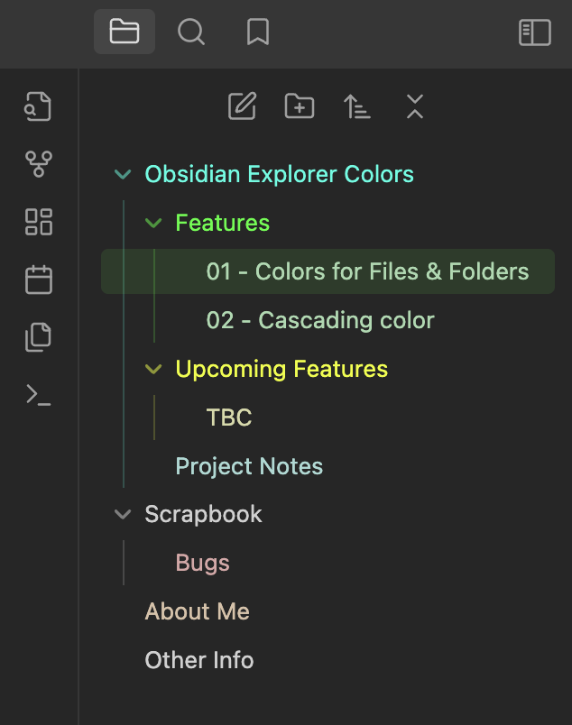

# Explorer Colors
Set cascading colors for files and folders in [Obsidian](https://obsidian.md/).

## About
For a while I have been using CSS snippets to customise the colors of files and folders in the Obsidian Explorer. While this worked in principle, it came with several limitations such as not being able to set colors for individual files and folders without indexing them as nth-child elements or by referencing the name of the file or folder. Adding new files and folders would also require updating the CSS snippet otherwise existing colors broke down, additionally, Obsidian could unload the explorer items if many paths were expanded and the items went out of view meaning that nth-child elements would not be applied to the correct items.

I wanted to make my experience easier to manage and more reliable so I decided to create a plugin and share it with the community.

## Main Features
The plugin is straightforward to use and provides the following features:

- An option to set a color for any file or folder by right-clicking on in item in the Obsidian Explorer and selecting `Set X Color` from the context menu.
- Render the colors cascading down to child items unless that item has its own color set.

## Upcoming
These are a few features that I would like to add in the future:

- Ability to toggle cascading colors on/off via the plugin settings.
- Option to add/remove colors from a list of favorites for quick access.

If you have any feature requests or suggestions, please feel free to open an issue or preferably, a pull request.

## Credits

The plugin is inspired by the work of other great creators in the community, namely I would like to thank FlorianWoelki and the rest of the [Obsidian Iconize](https://github.com/FlorianWoelki/obsidian-iconize) developers, as well as CyanVoxel's [Obsidian-Colored-Sidebar](https://github.com/CyanVoxel/Obsidian-Colored-Sidebar). Please check out their work I wouldn't be here without them!

## Support
Finally, If you would like to show your support, consider buying me a coffee. It would be greatly appreciated!

